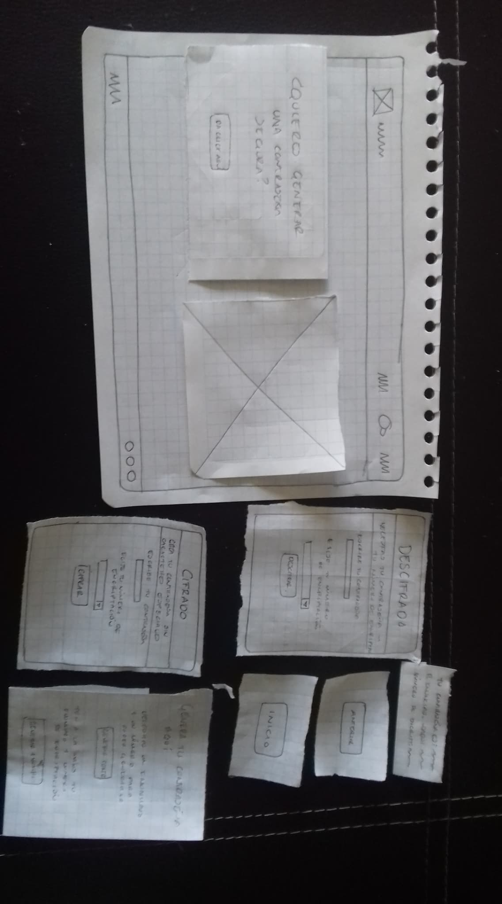
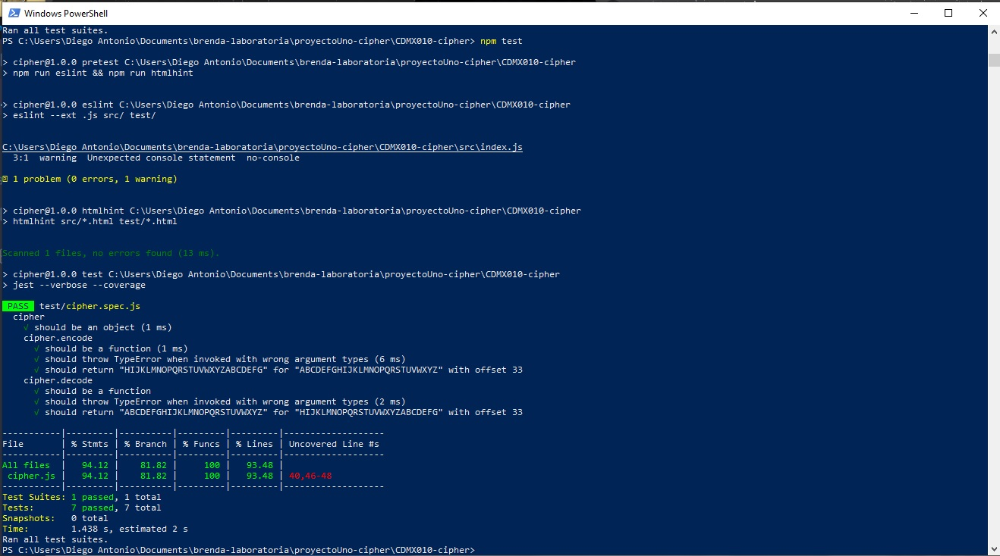

# Cifrado César

## Índice

* [1. Problema](#1-problema)
* [2. Usuario objetivo](#2-usuario-objetivo)
* [3. Descripción](#3-descripción)
* [4. Prototipo de baja fidelidad](#4-prototipo-de-baja-fidelidad)
* [5. Resultado de los test unitarios del boilerplate](#5-resultado-de-los-test-unitarios-del-boilerplate)

*****

## 1. Problema

Santandoor es un banco que ha tenido ciertos problemas para la migración de sus usuarios a la plataforma de banca en línea. A pesar de que ha desarrollado varias funcionalidades y ha incentivado a sus usuarios con ciertos beneficios, no ha logrado que al menos el 50% de sus cuentahabientes usen la aplicación.

Despúes de una ardua investigación, se encontró que la mayoría de esos usuarios corresponden a personas poco familizarizadas con la tecnología y con cierta desconfianza a proporcionar sus datos bancarios a través del móvil. Durante las entrevistas, al preguntarles cuál era el principal motivo de ello, una respuesta constante fue que su contraseña podría no ser tan segura por lo que fácilmente alguien pudiera acceder a su información.

Con base en lo anterior, se seleccionó la siguiente historia de usuario:

"Como cuentahabiente quiero poder codificar un enunciado o frase que me permita usarlo como contraseña de forma que al acceder a la banca en línea, tenga plena confianza de que mi información está segura."

## 2. Usuario objetivo

Se realizó un user persona que permitió tener más claro nuestro usuario y desarrollar la funcionalidad de acuerdo al comportamiento que tiene con respecto a la app de Banca en línea, así como entregarle un producto que pueda resolver su problema con la gereración de contraseñas seguras.

User persona:

## 3. Descripción

La funcionalidad de Cipher, basada en cifrado César permite a los usuarios crear una contraseña que pueda ser usada en la Banca en Línea. El cifrado César se basa en el cifrado por sustitución, en el cual se remplaza cada una de las letras del enunciado o frase inicial por otra letra del alfabeto. Esta letra se asigna de acuerdo al número de desplazamientos indicados previamente. Es decir, se identifica la letra inicial dentro del orden alfabético y para seleccionar la letra con la que será sustituída, se avanza el número de desplazamientos indicado.

## 4. Prototipo de baja fidelidad

Se realizó un prototipo de baja fidelidad, el cual fue testeado con dos personas que habían manifestado no acceder a la banca en línea por no contar con una contraseña que les pareciera segura. De acuerdo a su interacción con este prototipo y las propuestas manifestadas, se generó un último prototipo que fue testeado nuevamente. El prototipo final fue el siguiente:

Los prototipos realizados permitían la interacción del usuario con la interfaz, ya que se mostraban las instrucciones a realizar y de acuerdo a la interacción, se mostraban las siguientes pantallas o elementos resultados de la interacción. Además, se incentivó al usuario a narrar lo que iba haciendo para saber si las instrucciones eran claras.

## 5. Resultado de los test unitarios del boilerplate

Este proyecto está basado en el proyecto cipher de Laboratoria y forma parte del bootcamp remoto (Frontend developer), cualquier feedback, será bienvenido :)

brendagar88@gmail.com

